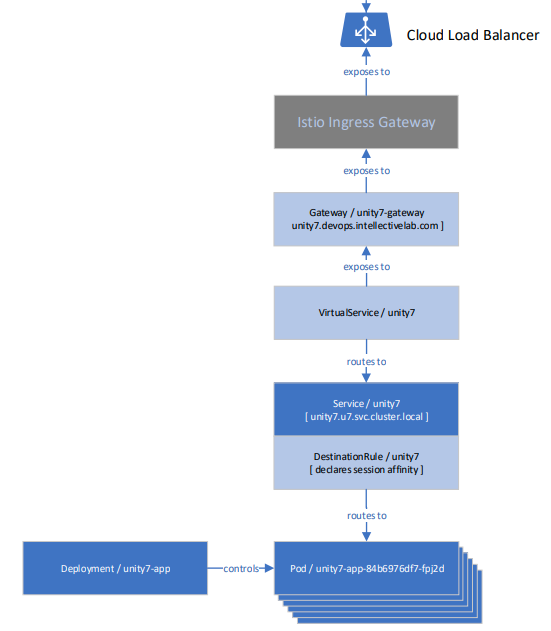

# Deploying on Kubernetes cluster
## Introduction
The following deployment architecture relies on Unity docker image described above, standard Kubernetes capabilities
and Istio service mesh (specifically, on its traffic management features).

Here's the general architecture:



Blue boxes are native Kubernetes entities - deployment, pods, service. Light-blue boxes are Istio's - gateway, virtual service and destination rule.
They allow implementing traffic routing with session affinity (sticky sessions) feature which is crucial for Unity 7 functioning and scaling.

Use the following documentation
 - [Kubernetes Documentation](https://kubernetes.io/docs/home/)
 - [Istio Docs](https://istio.io/docs/)
 - [Article "What are sticky sessions and how to configure them with Istio?"](https://dev.to/peterj/what-are-sticky-sessions-and-how-to-configure-them-with-istio-1e1a)

## Limitations
### Scaling
Unity 7 supports cloud deployment, but __it's NOT cloud-native__. Unity application scales with a limitation (not only in 
Kubernetes) - it requires session affinity to maintain user's authorization in underlying platforms (FileNet, CMIS, etc).
So when user logs in, all the following requests routed to the same pod.
If (when) this pod dies, user will be forced to relogin. This behavior is appropriate for stateful application server 
clusters (e.g. WebSphere Network Deployment), but it should be considered as a caveat in cloud-native world.

### SSO
Unity in Kubernetes __DOES NOT support SSO__ technologies such as Kerberos/SPNEGO.

### Configuration Console
To avoid a concurrent edit of the configuration, __Unity in Kubernetes DOES NOT support using Configuration Console__.

Moreover, this guide considers using a ConfigMap to handle Unity configuration files. On the container level they are mounted as
"read-only" directory. So, user will get an error when try to save the configuration.

## Requirements
 - Kubernetes 1.16 or newer
 - Istio 1.5 or newer
 - Configured load balancer (for on-premise installations).

## Installation steps
### Step 1. Istio Installation
Install [Istio 1.5](https://istio.io) on the cluster if it's not installed yet.
You may use [istioctl](https://istio.io/docs/setup/install/istioctl/) (probably, the easiest one), [Helm chart](https://istio.io/docs/setup/install/helm/) 
or [Operator](https://istio.io/docs/setup/install/standalone-operator/) as the way of doing it. 

You may use default Istio [installation configuration profile](https://istio.io/docs/setup/additional-setup/config-profiles/).
We'll need `istio-ingressgateway` and `istio-pilot` Istio's components.

### Step 2. Namespace (optional)
Probably, Unity 7 should be installed into dedicated namespace. If you manage cluster exlusively, you have to create
one, or ask cluster administrator for this.
To create a namespace by your own execute the following: 
```kubectl create namespace u7```
All the scripts and commands here consider using `u7` namespace. 
Replace all the occurrences of `u7` including the DNS address of the service (`unity7.u7.svc.cluster.local`) to the namespace you're going
to use.

### Step 3. Register a pull image secret
Create a secret to let Kubernetes access private container registry:
```
kubectl create secret docker-registry regcred --docker-server=docker.devops.intellectivelab.com --docker-username=<your-name> --docker-password=<your-pword> -n u7
```

### Step 4. Create a ConfigMap
We'll pack all the configuration we need to run Unity as a single ConfigMap entity.
Put all the required configuration files in the single local directory:
 - Unity main solution configuration
 - UCM solution configuration
 - Environment variables file
 - Customized `server.xml`

Create a ConfigMap:
```
kubectl create configmap unity7-config --from-file=./ -n u7
```

### Step 5. Configuring DNS name
Istio ingress gateway uses target host name to route traffic. Assign public address to the Istio endpoint using the DNS
configuration appropriate for your domain. See the Gateway/unity7-gateway entity, spec.servers[0].hosts parameter.
To find out the Istio ingress public gateway endpoint:
```
kubectl get svc istio-ingressgateway -n istio-system
```
Get this public IP or dynamic host name from the output. Use it as a target to configure your public DNS name.

### Step 5. Customize deployment
Get and customize the [deployment YAML file](https://gitlab.devops.intellectivelab.com/unity-classic/unity-7/blob/master/modules/vu-cloud-parent/vu-docker-ol/unity-k8s.yaml).
You may require to change the following elements:
 - DNS names of the `unity7` service (considering namespace name)
 - Public DNS name for Unity service (step 5). By default, it uses `unity7.devops.intellectivelab.com` in the YAML file.
 - Initial number of replicas in the deployment definition (we'll scale it later manually)
 - Session affinity configuration in the DestinationRule (cookie name and its lifetime)
 - Set up auto-scaling for the deployment, configure secured HTTPS connections, log gathering and other elements of production-ready deployment (see the "Advanced deployment" section above).  
Note that you can return and configure everything step-by-step by updating the YAML file and applying the changes again (see the next step).

### Step 6. Deploy Unity
Finally, execute the following to deploy Unity. Use the same command to update the definition.
```
kubectl apply -f unity-k8s.yaml -n u7
```

### Step 6. Verifying installation
See the pods:
```
kubectl get pods -n u7
```
Inspect the pod's log:
```
kubectl exec -it <POD_NAME_OR_ID> -- cat /logs/messages.log
```
See the service status:
```
kubectl get svc -n u7
```
After at least one pod goes into READY state, access the Unity app via browser using the public host name (step 5). 

For example: http://unity7.devops.intellectivelab.com/vu

### Step 8. Scaling deployment
To scale up (or down) Unity manually, execute the following:
`kubectl scale --replicas=<N> deploy/unity7-app`

Test if session affinity (aka "sticky sessions") works. Log into Unity, you should get the cookie 
(default name is UNITY_AFFINITY_ID, defined in the DestinationRule) with some unique value. It wires you as a user
with a specific pod which will serve all of your requests.

See the "Advanced deployment" section for auto-scaling options we have in Kubernetes.

## Advanced deployment
All the following elements should be taken in the consideration for the production-ready deployment. Use the following
section as a reference guide for these topics.

### Altering container lifecycle probes
By default, Unity deployment uses all the types of probes Kubernetes provide: livenessProbe, readinessProbe and startupProbe.

All of them are pointing on (`vu/ping.jsp` page) which is just a simple page within a Unity app. So if it answers we can
say that OpenLiberty is up and running, as well as Unity application was deployed and ready to recieve user requests.

However, you may need to tune the settings such as period, startup threshold and other.

Regarding the end-user application, we can even implement a custom probing endpoint which can provide a current
status in more sophisticated, application-specific way. Kubernetes will follow this status to manage pod lifecycle.

See [the documentation](https://kubernetes.io/docs/concepts/workloads/pods/pod-lifecycle/#container-probes) for additional
details.

### Implementing auto-scaling 
To serve effectively for the large (but usually intermittent) number of users, we may use Horizontal Pod Autoscaler
feature of Kubernetes to define an automated scaling strategy. It can rely on CPU utilization or any other custom metrics,
specific to each business application and environment.
See [the documentation for additional details](https://kubernetes.io/docs/tasks/run-application/horizontal-pod-autoscale/).

### Using SSL certificates and HTTPS
For the production site you'll have to apply mutual TLS and HTTPS for the incoming traffic.
Istio provides a number of ways to implement that:
- [File Mount](https://istio.io/docs/tasks/traffic-management/ingress/secure-ingress-mount/)
- [Secret Discovery Service](https://istio.io/docs/tasks/traffic-management/ingress/secure-ingress-sds/)
- [Cert-Manager](https://istio.io/docs/tasks/traffic-management/ingress/ingress-certmgr/)

### Gather and analyze logs
OpenLiberty container exposes the logs into the `/logs` directory. Thus, the common log file will be at `/logs/messages.log`.
There're number of ways to gather all the logs from pods into one place. The common choice is [ELK stack](https://www.elastic.co/what-is/elk-stack).
Use the following links to set up logs:
- [Liberty: Analyzing logs with Elastic Stack](https://www.ibm.com/support/knowledgecenter/SSAW57_liberty/com.ibm.websphere.wlp.nd.multiplatform.doc/ae/twlp_elk_stack.html)
- [New Kibana dashboard visualizations to spot potential problems in your Liberty servers](https://openliberty.io/blog/2020/01/23/Kibana-dashboard-visualizations.html)

### Deployment without Istio
Istio is well-known and widely used service mash. Besides of traffic management feature we used above, it offers
[many other useful capabilities](https://istio.io/docs/concepts/what-is-istio/).

However, if the target cluster doesn't have Istio installed it could be replaced by introducing the Ingress Controller
manually. [The NGINX Ingress Controller](https://kubernetes.github.io/ingress-nginx/) could be deployed and configured in this case. 
Be advised, Unity requires [configuring "Sticky sessions"](https://kubernetes.github.io/ingress-nginx/examples/affinity/cookie/) to scale.
